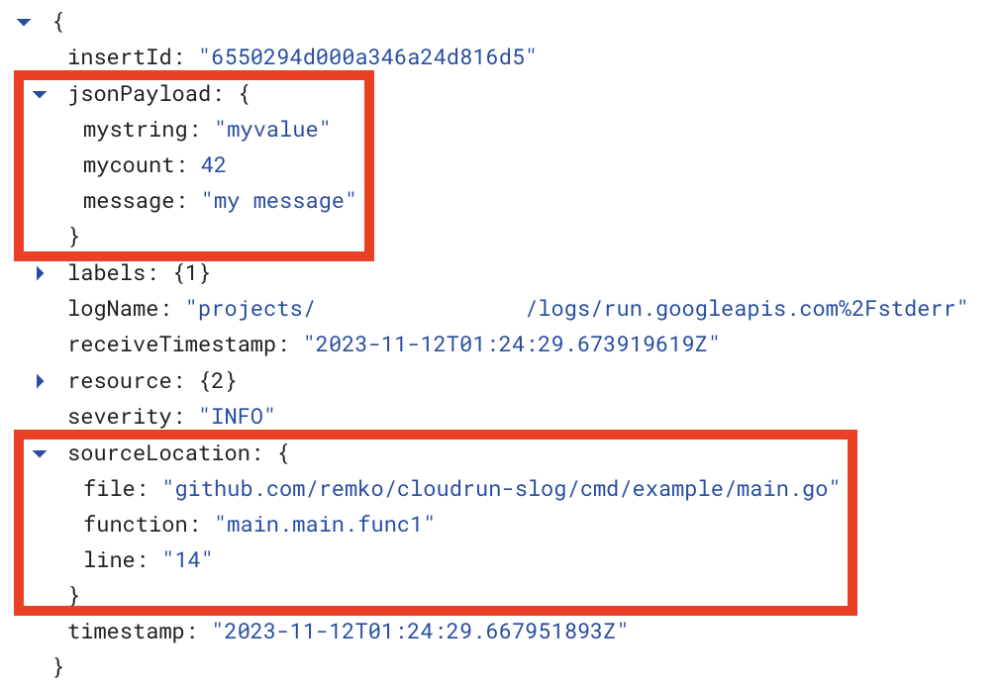
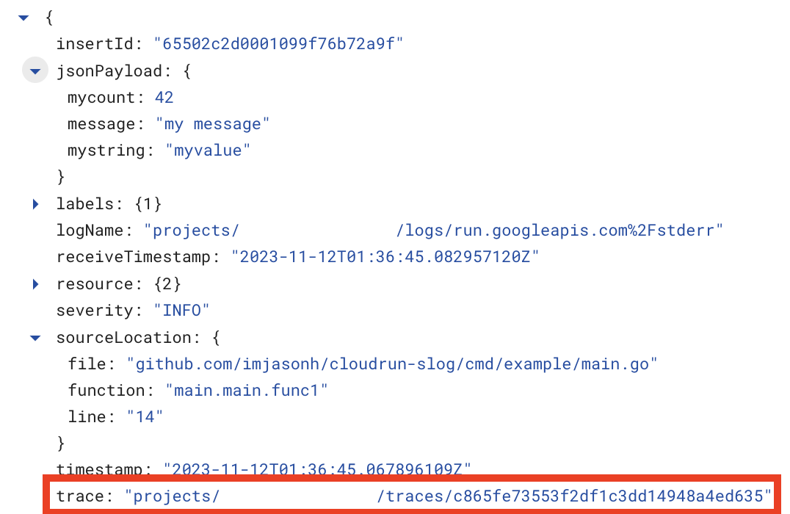

# Lightweight structured logging for Google Cloud Run using [`slog`](https://pkg.go.dev/log/slog)

Contrary to the [documented 'standard' approach for logging](https://cloud.google.com/logging/docs/setup/go), this doesn't use any third-party logging package for logging.

Instead, it relies on Cloud Run's support for ingesting structured logs by [simply printing JSON to standard error](https://cloud.google.com/run/docs/logging#using-json).

Note that App Engine supports the same structured JSON output approach, so the same code can be used there.

`slog` was added in Go 1.21, so using this requires Go 1.21 or later.

## Basic Usage

To use this, underscore-import this library, which will configure `slog` to use the JSON handler for all log messages:

Then when you use `slog`, all log messages will be output in JSON format to standard error, which is automatically ingested by Cloud Logging.

```go
import _ "github.com/imjasonh/cloudrun-slog"

...

http.HandleFunc("/", func(w http.ResponseWriter, r *http.Request) {
  slog.InfoContext(r.Context(), "my message",
    "mycount", 42,
    "mystring", "myvalue",
  )
})
```

This logs the message, with the additional structured logging fields in Cloud Logging:



## Correlating Logs with Requests

You can also use this to correlate log lines with the request that generated them, by associating the log message with the request's trace context header.

```go
import crslog "github.com/imjasonh/cloudrun-slog"

...

http.Handle("/", crslog.WithCloudTraceContext(http.HandlerFunc(func(w http.ResponseWriter, r *http.Request) {
  slog.InfoContext(r.Context(), "my message",
    "mycount", 42,
    "mystring", "myvalue",
  )
})))
```

This logs the message, associated with the request's trace, in Cloud Logging:



---

This repo is forked from https://github.com/remko/cloudrun-slog which originated this idea.
